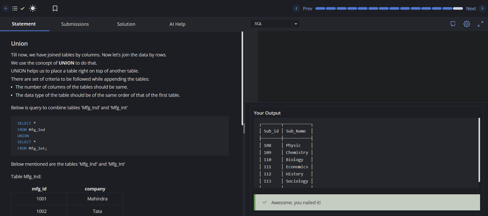

# Experiment 2 - Task 1

Name: ADIRYA

UID: 25BCS80034

## Aim

To combine the Arts and Science tables using UNION and output the final stacked table.

## Question

Write a query using UNION to stack the table 'Arts' over 'Science' and output the final table.

Note: The UNION statement removes duplicate data in the new table formed.

## SQL Queries Used

### Combine Arts and Science Tables

```sql
/* Write a query using union to stack the table 'Arts' over 'Science' and output the final table */
SELECT * FROM Science
union
SELECT * FROM Arts;
```

## Output

```text
The query stacks the rows from Science and Arts into a single table and removes duplicate rows.
```

## Output Screenshot



## Image Explanation

The screenshot shows the UNION query executed in the SQL editor. The result contains the combined rows from both Science and Arts tables in one output table, which verifies that UNION is working correctly.

## Result

The Arts and Science tables were combined successfully using UNION, and the final table was produced as expected.